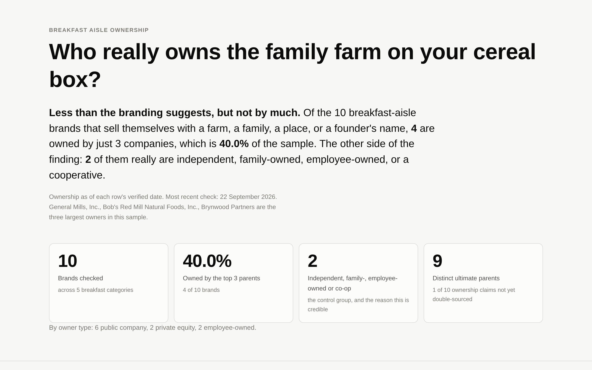

# Who owns the family farm on your cereal box?

**Live page: https://karishmadhingra30.github.io/farm_2_label/**

A hand-curated, fully sourced dataset of breakfast-aisle brands that sell
themselves with a farm, a family, a place, or a founder's name, paired with who
owns each one today. Every ownership claim carries two independent sources and
the date it was checked.

## The question and the answer

When a breakfast brand puts a farm, a family or a founder's name on the box, who
owns that brand now? Of the 10 brands checked so far, 4 are owned by just 3
companies, and 2 really are employee-owned, so the branding is not always a
story about someone else's balance sheet.

**Read that number as a work in progress.** Ten rows is too small a sample for
the concentration figure to mean much. The target is 40 to 50 brands and the
work queue is in [DECISIONS.md](DECISIONS.md) section 6. What is finished is the
pipeline, the page and the evidence standard; what is unfinished is the row
count.



The screenshot shows the headline and the summary tiles. The ownership tree and
the map are not in it because they need D3 and Leaflet from a CDN that the
machine this was built on could not reach. They render normally in a browser.

## How brands were chosen

> A brand is included if its name, its packaging, or its own "our story" page
> leans on a farm, a family, a homestead, a place of origin, or a named founder.

The signal has to be something the brand itself puts forward. A company that
happens to be family-owned but never says so does not qualify. A company that
says "family-owned since 1887" qualifies whether or not it still is.

The rule is deliberately blind to who owns the brand. The tempting alternative,
"brands that look small but are not", builds the answer into the selection by
excluding every brand that looks small and is small. Those brands are in the
dataset on purpose, and they are what makes the finding worth anything.

Scope is the breakfast aisle only: cold cereal, granola, oatmeal and hot cereal,
breakfast bars, and pancake and waffle mix.

## How ownership was verified

1. **Two independent sources per claim.** Where possible one is the parent
   company's own material: its brands page, its history page, its investor page.
   The second is independent of it: a deal announcement, a filing, or trade
   press.
2. **Nothing from memory.** Brand ownership moves through acquisitions,
   spinoffs, and private equity sales. Every row was looked up on the page it is
   cited to.
3. **A date on every row.** The page says "as of" and means it.
4. **A Wikidata cross-check**, in `pipeline/validate.py`. It reads each brand's
   `owned by` (P127) and `parent organization` (P749) and compares them with the
   CSV. A disagreement is never auto-corrected, because Wikidata is
   volunteer-edited and goes stale. It is a prompt to recheck the row by hand,
   and the decision goes in that row's `notes`.
5. **Gaps are visible, not hidden.** Two markers in `notes` drive two different
   badges in the table:

   | Marker | Badge | Means |
   |---|---|---|
   | `unverified` | `1 source` | the ownership claim is not backed by two independently read sources |
   | `origin_unconfirmed` | `origin?` | ownership is fine, but the brand's self-claimed home town is not cited to the brand's own page |

One thing this caught: a search summary said Arrowhead Mills was sold to private
equity in 2025. Opening the articles showed the sale closed in 2019. That is the
two-source rule earning its keep.

## Architecture

```
  data/brands.csv          hand-curated, 17 columns, the product
  data/places.csv          city -> lat/long, written by hand
        |
        |  python -m pipeline.validate      two-source + date checks
        |                                   Wikidata P127 / P749 cross-check
        v
  python -m pipeline.build
        |
        v
  site/data/brands.json    committed: { brands, parents, summary }
        |
        v
  site/index.html          reads that one file, makes no API calls
        |
        +--> tree.js       D3 Sankey: brands on the left, owners on the right
        +--> map.js        Leaflet: claimed origin --- owner headquarters
        +--> table.js      every row, every source, every date
```

The CSV is the only place a fact is entered by hand. `validate.py` checks that
each row carries what it claims to and asks Wikidata for a second opinion.
`build.py` attaches coordinates, groups brands by owner, computes every number
the page displays, and writes one JSON file. That file is committed, so the page
works even if nobody ever runs the pipeline again. The page fetches it once and
does no other network calls, which is why a dead API can never break it.

### Layers

```
 ┌───────────────────────────────────────────────────────┐
 │  page      index.html · tree.js · map.js · table.js   │  browser, no build
 ├───────────────────────────────────────────────────────┤
 │  json      site/data/brands.json                      │  committed artifact
 ├───────────────────────────────────────────────────────┤
 │  pipeline  validate.py · build.py                     │  laptop and CI only
 ├───────────────────────────────────────────────────────┤
 │  data      brands.csv · places.csv                    │  hand-curated
 └───────────────────────────────────────────────────────┘
```

Each layer only talks to the one below it. The page cannot reach the CSV, and
the pipeline cannot reach the browser.

## Running it

```bash
pip install -r requirements.txt

# Field checks only, no network. This is what CI runs.
python -m pipeline.validate --offline

# Field checks plus the Wikidata cross-check. Caches to data/cache/,
# sends a descriptive User-Agent, and keeps to about one request a second.
python -m pipeline.validate

# Rebuild site/data/brands.json from the CSV.
python -m pipeline.build

python -m pytest
```

To preview the page locally:

```bash
cd site
python -m http.server 8000
# then open http://localhost:8000
```

Serving it matters. Opening `index.html` straight off the filesystem fails,
because browsers block `fetch` on `file://` URLs and the page loads its data
with `fetch`. The page says so if it happens.

## Adding or correcting a brand

1. Add a row to `data/brands.csv`. Every column is described in
   [DECISIONS.md](DECISIONS.md) section 3, and the rules it has to satisfy are
   in section 4.
2. If the row names a city that is not already in `data/places.csv`, add it
   there with its latitude and longitude. The build fails loudly if you forget,
   rather than silently dropping a point off the map.
3. Run `python -m pipeline.validate` and resolve anything it reports. A Wikidata
   mismatch is a prompt to look again, not an instruction to change the row.
4. Run `python -m pipeline.build` and commit the updated
   `site/data/brands.json` along with the CSV. CI rebuilds the JSON and fails if
   the committed copy is out of date, so the page can never show stale numbers.

If you cannot get two independent sources for the ownership claim, put
`unverified` in `notes` with the reason. Do not drop the row. A visible gap is
worth more than a clean-looking dataset with a hole in it.

## Limits

- **Ownership changes.** These rows are a snapshot on the dates shown. Private
  equity holdings in particular turn over fast.
- **A big owner does not mean a worse product.** Nothing here measures quality,
  ingredients, farming practice, or how workers are treated.
- **Brand origin is the brand's own claim.** It is not a check on where anything
  is grown, milled or made today. On 8 of the 10 current rows the origin is not
  even cited to the brand's own page, and those rows say so.
- **This is one aisle, not the food system.** The concentration measured here is
  concentration within this sample.
- **The chain is simplified.** Real structures include intermediate holding
  companies, minority stakes, and rights that differ by country. The dataset
  records a direct owner and an ultimate parent; the tree uses the ultimate
  parent.
- **Wikidata was unreachable while curating**, so no row uses it as a source.
  The cross-check code is complete and runs from a laptop.

## Decisions

Every judgement call, including the ones that went the other way, is written
down in [DECISIONS.md](DECISIONS.md): the selection rule and why it is shaped
that way, the scope boundaries, the evidence rules, the 57-brand candidate
queue, and the decisions made during research.

## Credits

Ownership data hand-curated from company materials, filings and news reports.
Map tiles by [CARTO](https://carto.com/attributions), map data by
[OpenStreetMap](https://www.openstreetmap.org/copyright) contributors. Charts
built with [D3](https://d3js.org/) and [Leaflet](https://leafletjs.com/).
Brand names appear as plain text; no logos or packaging images are used.
